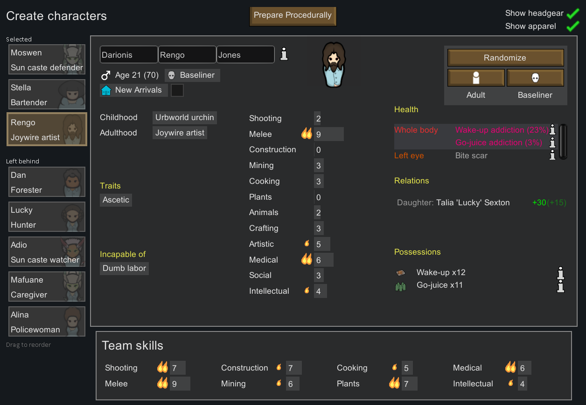
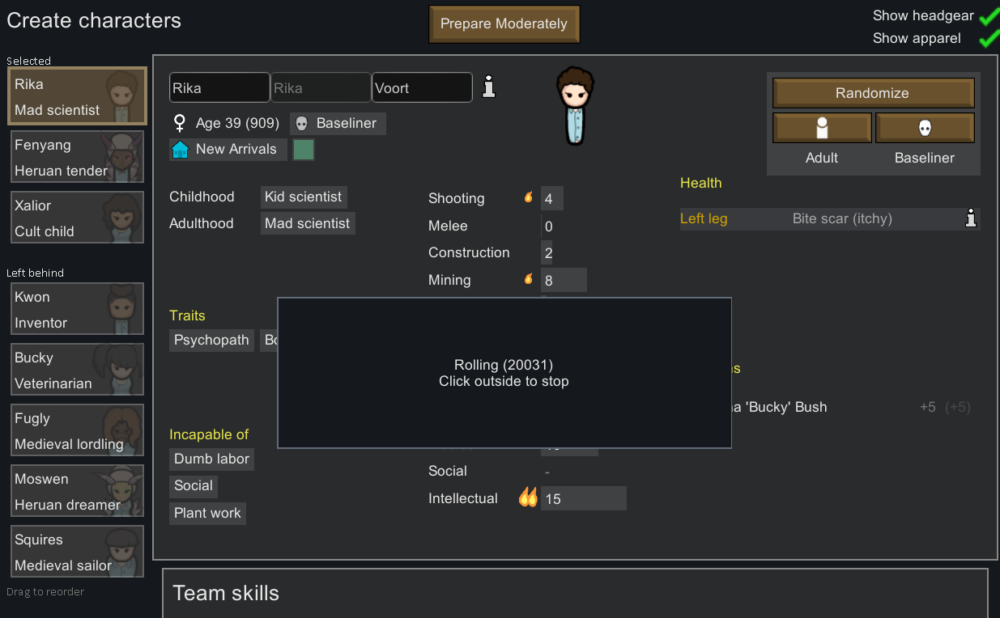

# The Two Schools of Thought For Starting Colony Preparation

Essentially, mods can approach starting colony setup by doing either two things:

## Allow editing pawns after they are generated
    * Prepare Carefully, Character Editor
    * Making strong assumptions about the ThingDef of the pawn will lead to problems in hediffs or generation.
    * Changing the ThingDef of a pawn after generation is, to say the least, fraught. It's a very difficult problem that PawnMorpher will get right, and basically nothing else will.
    * Unsurprisingly, most of these mods end up being a big problem for mod troubleshooters, to which they will ignore most troubleshooting requests with these mods in the modlist.
    * Even ignoring the troubleshooting aspect, giving full editorial control of pawns has UX downsides:
        * Having full editorial control over every aspect of pawns means that it is up to the players to try to match their desired setup. I think this is overkill for what the majority of players actually want.
        * Working with pawns that are flawed in some way 
        
## Don't edit pawns at all, but randomize pawns until they meet certain criterion.
* Prepare Moderately, Random+
* This guarantees that pawns won't be corrupted, or put in a bad state, which is good!
* There are still some UX or overall design issues, in my opinion:
    * You don't know going into the mod what an appropriate skill filter, or trait filter, is. This can lead to randomization going on for the thousands or more for what you might have thought was a reasonable pawn combination.
    * Most pawn generation, that happens to fit even basic criterion, will also end up with some pawns being significant outliers. 

As an example, let's look at this pawn generated by Prepare Procedurally:

This is an utterly regular pawn. It's about the exact average or mean of passions - two major plus two minor is five passion points, the center of the gaussian distribution that pawn generation will use. Those passions are applied to a specific combination of shuffled backstories, which all have equal distributions in the offworld category. This will take into the high thousands of pawn rerolls to get this kind of pawn, specifically, just filtering by age and to pick up the specified passions.

I think that, leveraging how backstories and other factors can influence pawn generation, that "worse" pawns can be generated much faster. So my goal is to have an even-closer-to-vanilla experience of working with flawed pawns, almost as fast as just instantly hitting next on the character creation menu.