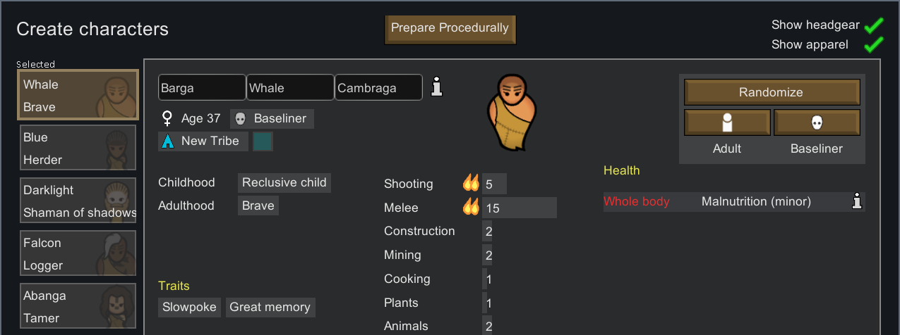
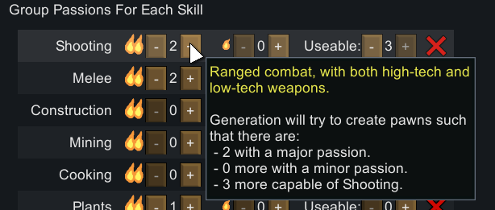
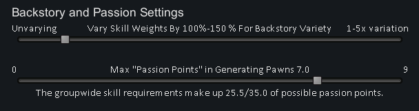
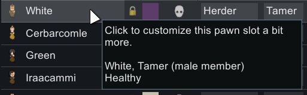
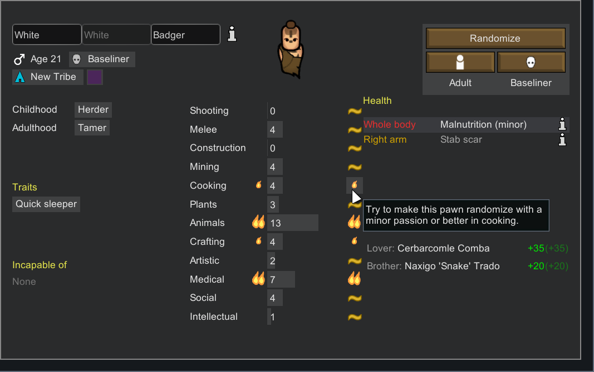
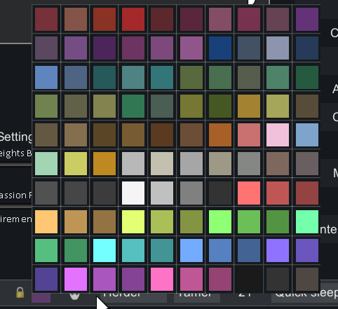
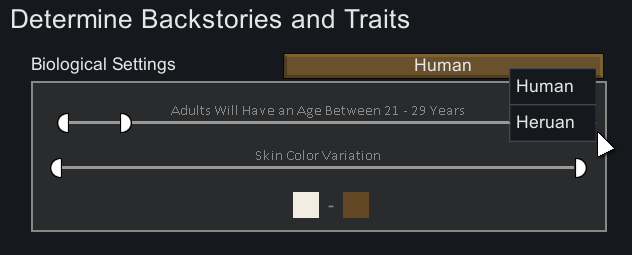

Colony-creation powertool to quickly create characters to complement each other. Instead of trying to randomize pawns until a pawn matches your specified needs, Prepare Procedurally will work backwards to try to find the best backstories and conditions for you.

Prepare Procedurally is meant to **faithful to standard pawn generation, but fast.** This mod does not change any behavior outside of colony startup, and it does not change the "Randomize" button's behavior on the Create characters menu. 
# What this mod does

This mod will add a button to the Create Characters menu.

Clicking will open up the prepare procedurally user interface:

Any changes made to Biological Settings, Backstory Settings, and Group Passions will automatically reroll for any unlocked pawns. If you want to keep a pawn, you can click the lock icon, and it will reroll other pawns to try to meet the standards with that pawn in mind.

In order to keep characters unique and interesting, procedural generation will generally avoid repeating the same backstory twice.
### Group Passions and "Passion Points"

Group passions start out pre-populated with a minimalist setup based on starting scenario, with some variation based on factors like ideology and how mountainous your starting tile is. 

Each skill setting allows setting an amount of major passions to try collecting, as well as minor/secondary passions and capable workers in that given skill.

For how likely you are to actually fulfill those requirements, you can have a look near the passion points of the UI:

"Passion Points" are determined on pawn randomization. Major passions cost 1.5 of these points, and pawns will have a certain number of them generated. Minor passions cost 1 of these points. 

The default setting of 7.0 passion points is a roughly ~2% chance of happening that or higher. It's astonishingly rare to have a full 9 passion points (0.003% chance) but it is technically possible in pawn generation.

## Specific Character Customizations

### Specific Skill Targets
Clicking on a pawn in the pawns table will open up a customization menu for a specific pawn

From here, you have full control over what passions you'd like that individual pawn to randomize for specific skills.

### Trait Customization
Trait customization is based on rules set by backstory, starting scenario, and any mod that grants new traits.
* Backstory traits will not be removeable, as they represent a fundamental part of the pawn's story
* Traits added by the Starting Scenario, or forced by mods, will not be removeable as well. They will also not count towards any trait limit.
* Other traits can be added or removed as you please. Locked pawns will have traits directly added or removed, and traits for a given slot will be respected if you randomize further.

### Other Customizations
If you have the Ideology DLC, choosing a favorite color is possible on the table of starting pawns:

If you have the Biotech DLC, changing the xenotype of a pawn through the detailed customization menu or in Create Character menu will be respected.

# Humanoid Alien Races Support
This mod has specific support for Humanoid Alien Races. If there are multiple races available for the starting scenario, the age ranges for each individual race will be editable separately.

The procedural generation will randomize the pawn first, to find the alien race and available backstories, and then work backwards to solve for the best backstory and relevant skills.

# F.A.Q.

#### Can I add this mod mid-save?
This mod only has an effect within the Prepare Procedurally UI, which is only available at colony creation. It is safe to add or remove on any save.
#### Can I have characters younger than 20 (adulthood age for HAR)?
In order to more effectively create pawns, the age range is limited to what age range supports Adulthood backstories. 

You can still randomize pawns in the Create Characters menu; this mod does not change the behavior of that page whatsoever.
#### Is This Mod Compatible with X?
If it affects pawn generation significantly and it's not a HAR mod, it won't follow the custom pawn generation rules. 

If said mod is interesting to work with, I may get around to adding support for it. Probably not, though.

This mod purposefully avoids anything other than meddling with starting pawns. There are no harmony patches that affect the game once a map has started, so it should be compatible with most other mods.